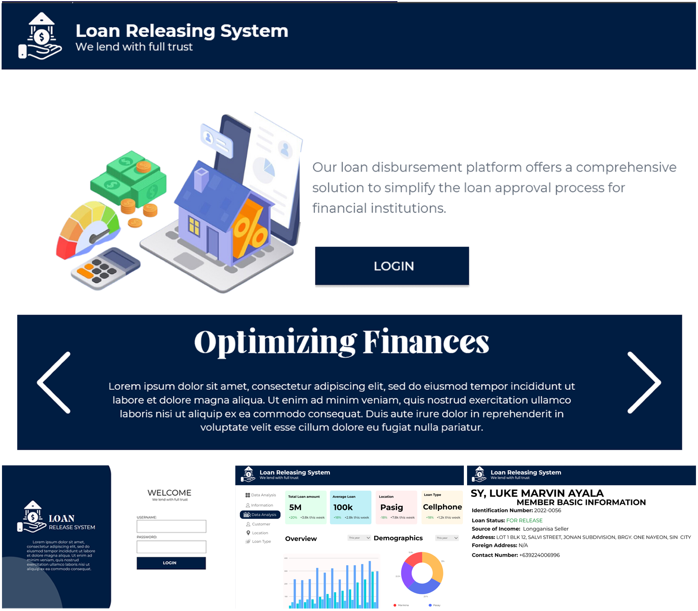
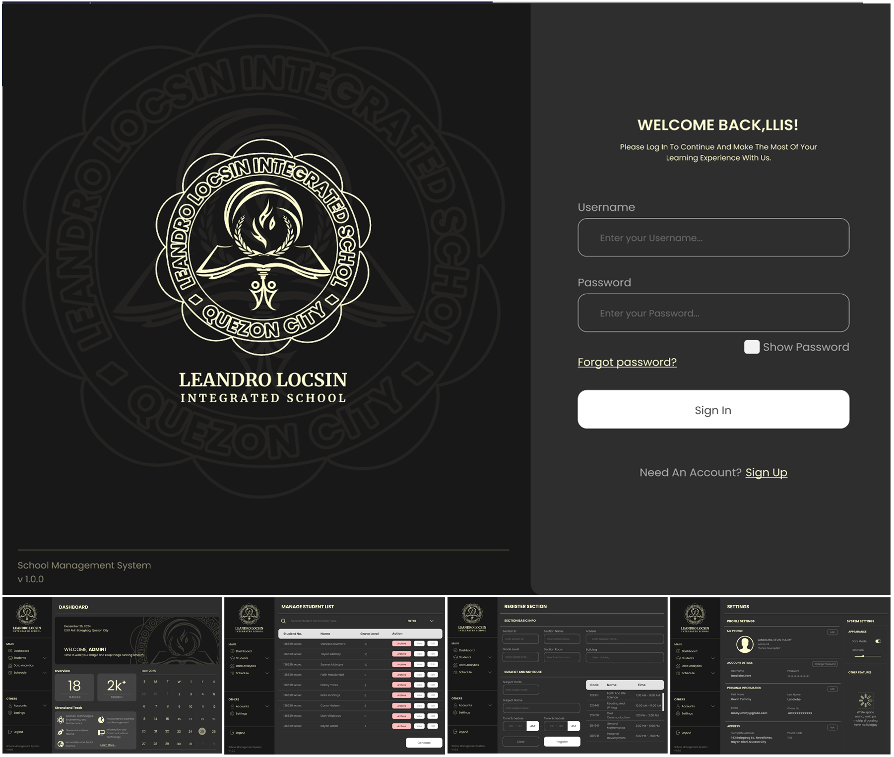
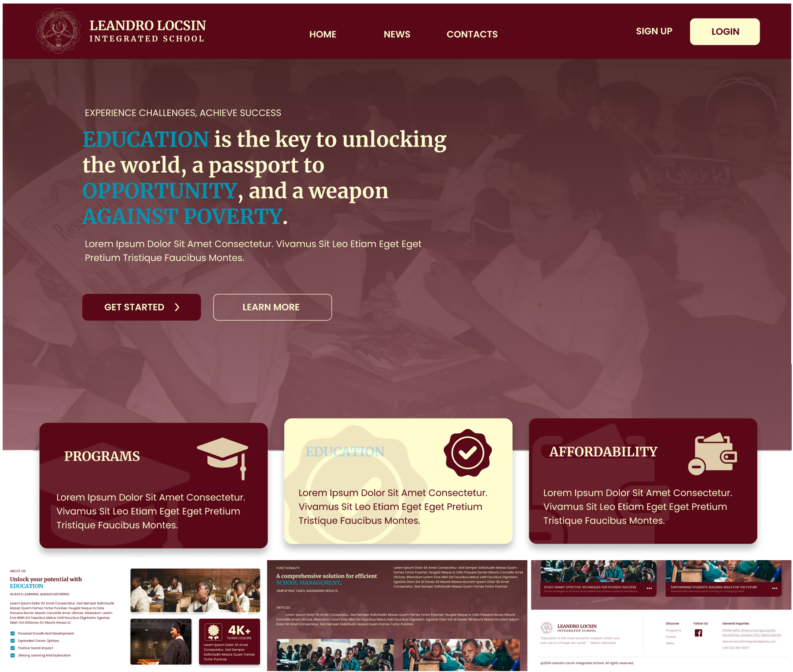
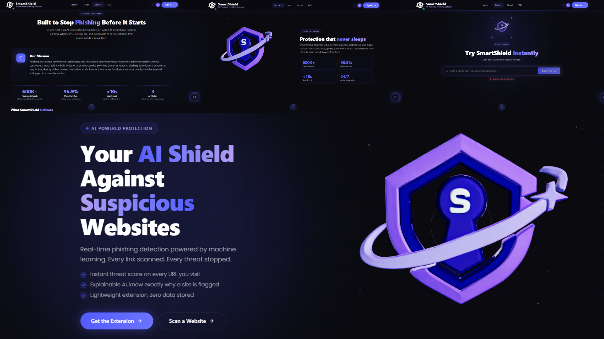
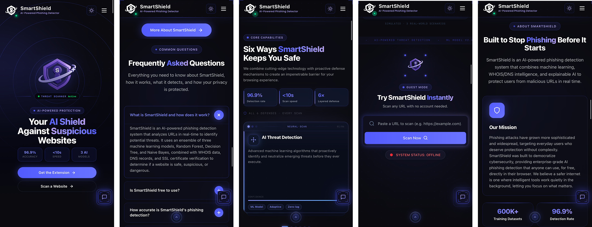

## INTRODUCTION
### About Me

> Hi! I'm Jerico R. Francisco, a passionate designer who enjoys creating user-friendly and visually appealing digital experiences. I love exploring new design tools and continuously improving my skills, whether I'm sketching ideas on paper or bringing them to life on my computer.

> I'm a UI/UX designer and aspiring front-end developer passionate about creating intuitive, user-focused digital experiences. I combine creativity with technical skills to design clean interfaces and develop functional web solutions. With familiar in Java programming, Figma, and front-end technologies, I'm always eager to learn, collaborate, and grow while building impactful digital products.

[Downloadable CV](https://drive.google.com/file/d/1cfnYfDF7Q7nltuMBQEkrqNWfrP61Fxm8/view?usp=sharing)

___

# Education
- **Quezon City University (2022 - 2026)** | Bachelor of Science in Information Technology
   
___

## WORK EXPERIENCE

**Concentrix Philippines - ETON** 
___(September 2025 – February 2026)___

- Assisted in troubleshooting technical issues, managing support tickets, supporting daily IT operations, and resolving system-related issues with the IT team.
- Strengthened my technical support, problem-solving, teamwork, and workplace communication skills through real- world IT operational experience.

___

## CONTACT ME

I'm always open to new opportunities, collaborations, and exciting projects. If you'd like to work together or discuss an idea, feel free to get in touch. I'd be happy to connect!

__Socials__

___

__Mobile Number:__ +63 994 809 1421

__Location:__ [209 P. Dela Crux St. San Bartolome, Novaliches, Quezon City. ](https://www.google.com/maps/place/209+Pablo+Dela+Cruz,+Novaliches,+Quezon+City,+Metro+Manila/@14.7078588,121.0302614,17z/data=!3m1!4b1!4m6!3m5!1s0x3397b11fdd664a99:0x9b70d6c015800767!8m2!3d14.7078588!4d121.0328363!16s%2Fg%2F11g0h832d_?entry=ttu&g_ep=EgoyMDI2MDcyMi4wIKXMDSoASAFQAw%3D%3D)

__Email:__ *jericof241@gmail.com*

___

Looking forward to hearing from you!

___

## SKILLS
> __Tools & Tech:__ Git & GitHub, XAMPP, Figma, Canva, Capcut.
> __Web Development:__ JavaScript, HTML5, CSS3, React, Basic Java Programming.
> __Core Competencies:__ Frontend Development, UI/UX Design, Responsive Web Design, Wireframing & Prototyping, Technical Support.

___

## PROJECTS

### Project System

#### ___Hotel Management System___
__May 2023__

Overview

> Developed a Hotel Management System using PHP, JavaScript, and SQL to streamline hotel operations, manage reservations, and enhance the overall guest experience through an efficient and user-friendly interface.

Programming Language: ___Java with XAMPP Database___

Position: ___UI/UX Designer___

___

#### ___Library Magement System___
__October 2023__

Overview

> A desktop-based Library Management System developed using Java Swing and MySQL to simplify library administration by managing book inventories, member records, and borrowing transactions in an organized and efficient manner.

Programming Language: ___Java with MySQL___

Position: ___UI/UX Designer___

___

#### ___Loan Release System___ (_Desktop_)
__Arpil 2024__

Overview
  
  > A Loan Release System developed using Java and Oracle to simplify the loan application and approval process. The system provides intuitive dashboards for both applicants and administrators, allowing users to track application statuses, upload required documents, and manage payment schedules through a clean and user-friendly interface.
  
Software Used: ___Figma___

Position: ___UI/UX Designer___

___

#### ___Leandro Locsin Integrated School___ (_Desktop_)
__February 2025__

Overview

   > The School Management System for desktop streamlines administrative tasks within educational institutions, including student enrollment, attendance tracking, and grade management. Its organized layout allows for quick access to essential features, enhancing overall efficiency for staff and administrators.
  
Software Used: ___Figma___
 
Position: ___UI/UX Designer___

___

#### ___Leandro Locsin Integrated School___  (_Website_)
__January 2025__

Overview

  > The School Management System website provides a responsive platform for students, parents, and staff, featuring announcements, event calendars, and downloadable resources. Designed for ease of use, it promotes engagement and communication among all stakeholders in the school community.
  
Software Used: ___Figma___

Position: ___UI/UX Designer___

___

#### ___SMARTSHIELD: An AI-Powered Phishing Detector Website Using Ensemble Model for Safer Browsing___  (_Website_)
__March 2026__

Overview

  > Developed a phishing detection website using Next.js, Supabase, and Python, powered by an ensemble machine learning model to accurately identify and classify phishing URLs. The system enables users to analyze suspicious links in real time, helping improve cybersecurity awareness and protect against online threats through a fast, secure, and user-friendly interface.
  
Software Used: ___Figma___Visual Studio___

Position: ___Head UI/UX Designer___Front-End Developer___

[System Video Demonstration](https://drive.google.com/file/d/1m1KbUXHEqjSG8iqK_nCZxRX9DVBQucsf/view?usp=sharing)

___

#### ___SMARTSHIELD: An AI-Powered Phishing Detector Website Using Ensemble Model for Safer Browsing___  (_Mobile_)
__March 2026__

Overview

  > Developed a phishing detection website using Next.js, Supabase, and Python, powered by an ensemble machine learning model to accurately identify and classify phishing URLs. The system enables users to analyze suspicious links in real time, helping improve cybersecurity awareness and protect against online threats through a fast, secure, and user-friendly interface.
  
Software Used: ___Figma___Visual Studio___

Position: ___Head UI/UX Designer___Front-End Developer___

[System Video Demonstration](https://drive.google.com/file/d/1m1KbUXHEqjSG8iqK_nCZxRX9DVBQucsf/view?usp=sharing)

